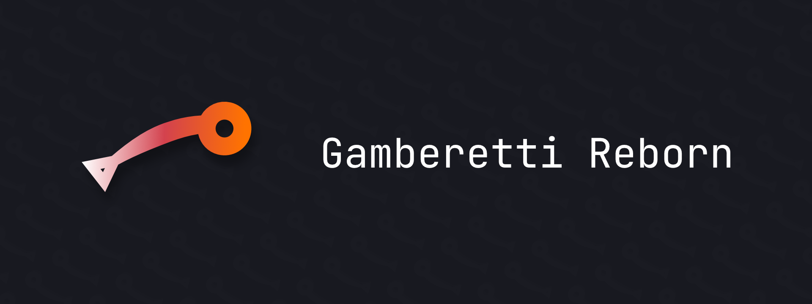
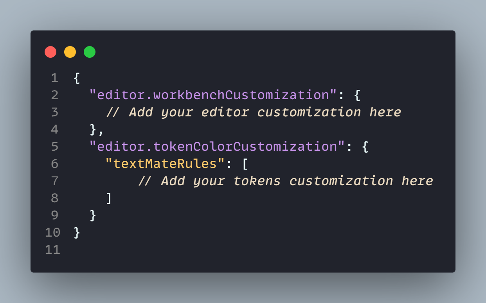

# Gamberetti Reborn

 

> A nice to the eye theme, inspired by shrimps.

_Gamberetti Reborn_ is a revisitation of a dead and not maintained project that you can find on the [VSCode marketplace](https://marketplace.visualstudio.com/items?itemName=ParrotStudios.gamberetti-theme). The theme is a designed to reduce eye strain without sacrificing the power of proper syntax highlighting.

The theme is specifically tested on:
- HTML
- JS/TS
- CSS/LESS/SCSS
- Rust
- C/C++

## Installation

The theme is available for free installation on the [VSCode marketplace](), just download it and install it!

## Some screenshots

## Customization

You can override the theme settings according to your preferences without forking it by changing your `settings.json`. In order to do so you should add the following configuration

 

You can find the documentation about the tokens you need to use on [VSCode documentation](https://code.visualstudio.com/api/extension-guides/color-theme) page.

## Recommended fonts
The font used for screenshots is a paid font: [MonoLisa](https://www.monolisa.dev/). I suggest to pair the theme with [JetBrains Mono](https://www.jetbrains.com/lp/mono/) but it works well with basically every monospaced font.